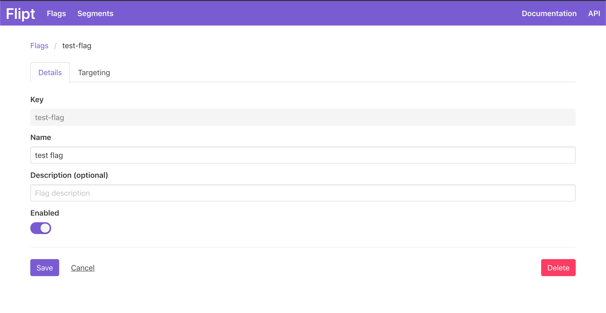
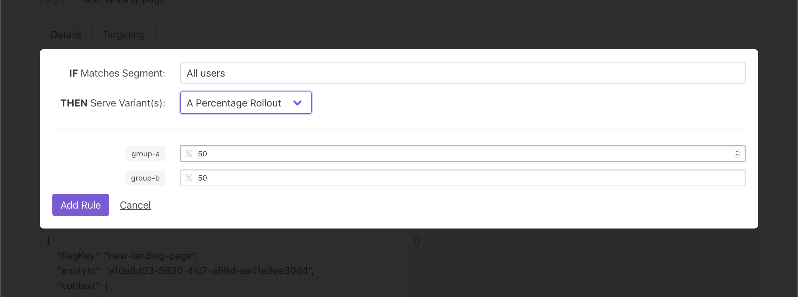

# Use Cases

In this section we will explore two of the most common use cases that Flipt is used for: **feature flagging** and **A/B testing**.

## Feature Flagging

Feature flagging can be used to switch features on and off. This can be done by toggling a flag within Flipt.

Once you have a flag created, you can control whether or not a feature is enabled within your application by toggling the `enable` slider in the Flipt UI.



An example request to evaluate whether or not this flag is enabled would look like this:

```go
res, err := client.GetFlag(context.Background(), &flipt.GetFlagRequest{
  Key: "test-flag",
})
```

The response will contain a field `Enabled`, which could be used like this:

```go
if res.Enabled {
  // Code for your feature
}
```

## Percentage Rollouts

Variant testing can be accomplished by setting up a percentage rollout rule in Flipt. See [Getting Started](./getting_started) to learn how to accomplish this.

In this example rule, we have two variants that we are targeting, `group-a` and `group-b`, each with a 50% distribution.



An example request to evaluate this rule within your application would look like this:

```go
res, err := client.Evaluate(context.Background(), &flipt.EvaluationRequest{
  FlagKey:  "new-landing-page",
  EntityId: "test@email.com",
})
```

:::info
Notice that we are using an email address for the `EntityId`. This does not need to be an email address, it just needs to be a unique identifier for your users.
:::

The response will contain which variant we should show for this user, either `group-a` or `group-b`:

```go
if res.Value == "group-a" {
  // Render landing page for group a
} else {
  // Render landing page for group b
}
```
